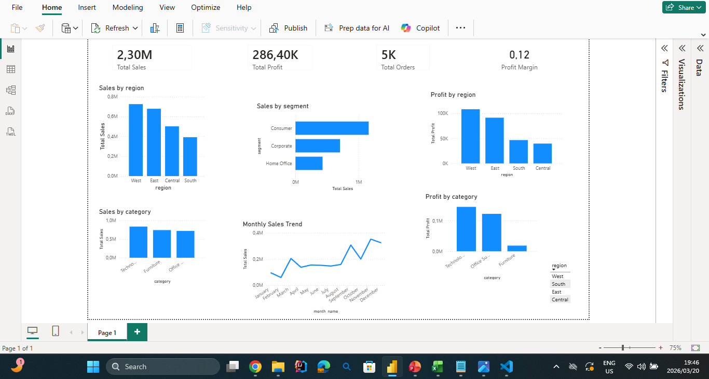

# Retail-sales-analytics

End-to-end retail sales analytics project using Excel, Python, and Power BI.

# Table of Contents

Project Overview

Dataset

Tools & Technologies

Data Preparation

Key Metrics

Key Insights

Business Recommendations

Dashboard Features

Project Structure

Conclusion

# Project Overview

This project presents an end-to-end analysis of retail sales data to uncover insights about business performance across regions, product categories, customer segments, and time.

The objective is to transform raw transactional data into actionable insights using data cleaning, exploratory analysis, and visualization techniques.

# Dataset

The dataset contains approximately 10,000 retail transactions, including:

Order Date

Product Category

Customer Segment

Geographic Region

Sales Revenue

Profit

Discount

Quantity

# Tools & Technologies

Excel – exploratory data analysis (pivot tables, initial insights)

Python (Pandas) – data cleaning and transformation

Power BI – dashboard development and visualization

DAX – creation of analytical measures

# Data Preparation

Data preparation was performed using Python (Pandas):

Cleaned column names

Converted date fields

Fixed data types

Created new features:

order_year

order_month

month_name

profit_margin

The cleaned dataset was then used for analysis and visualization.

# Key Metrics

The dashboard focuses on four main KPIs:

Total Sales

Total Profit

Total Orders

Profit Margin

# Key Insights

The West region generates the highest sales and profit, indicating strong market performance.

The South region contributes the least revenue.

Technology is the most profitable category.

Furniture has high sales but very low profit, suggesting pricing or cost issues.

The Consumer segment drives the majority of revenue.

Sales show strong seasonality, peaking in November and December.

#Business Recommendations

Review discount strategies in the Furniture category to improve profitability.

Increase marketing efforts in high-performing regions such as the West.

Focus on promoting Technology products due to strong profit margins.

Prepare inventory and campaigns for peak seasons (November–December).

# Dashboard Features

The Power BI dashboard includes:

KPI Cards (Sales, Profit, Orders, Margin)

Sales by Region

Profit by Region

Sales by Category

Profit by Category

Monthly Sales Trend

Sales by Customer Segment

Interactive filtering (Region slicer)

# Conclusion

This project demonstrates the complete analytical workflow from raw data to business insight. It highlights the ability to clean data, analyze trends, and communicate results through an interactive dashboard.
